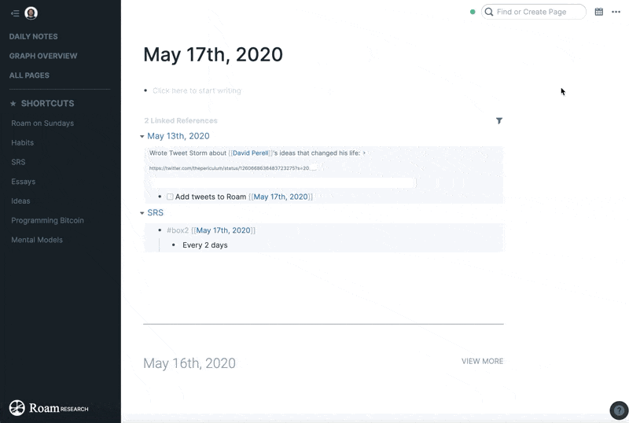
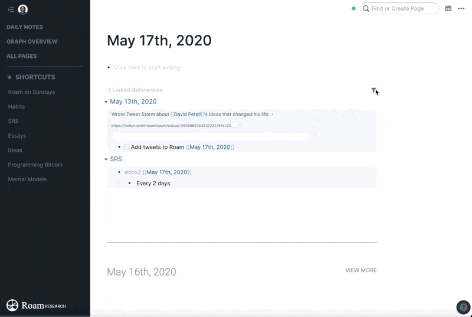

# brain-dump

A Clojure library designed to help move your notes to [Roam Research](https://roamresearch.com).

brain-dump will extract all your page titles and linked references and automatically link the notes you want to move to Roam

## Usage

Download instructions:

`git clone https://github.com/Bardia95/brain-dump.git`

`cd brain-dump`

Export your Roam database to JSON like so:

Save/move the JSON to the brain-dump root project directory.

Put in any files you want to convert into the input-notes directory.

Then run this in your terminal:

`lein run "YOUR_ROAM_DIRECTORY.json"`

Make sure to replace "YOUR_ROAM_DIRECTORY.json" with the name of your roam directory file.

The updated files will be inside the roamified-notes directory.

Import your new Roamified notes to Roam like so:

## Dependencies

`java`
`jvm`
`clojure`
`leiningen`

## License

Copyright © 2020 The Periculum Erudition Corporation

This program and the accompanying materials are made available under the
terms of the Eclipse Public License 2.0 which is available at
http://www.eclipse.org/legal/epl-2.0.

This Source Code may also be made available under the following Secondary
Licenses when the conditions for such availability set forth in the Eclipse
Public License, v. 2.0 are satisfied: GNU General Public License as published by
the Free Software Foundation, either version 2 of the License, or (at your
option) any later version, with the GNU Classpath Exception which is available
at https://www.gnu.org/software/classpath/license.html.
